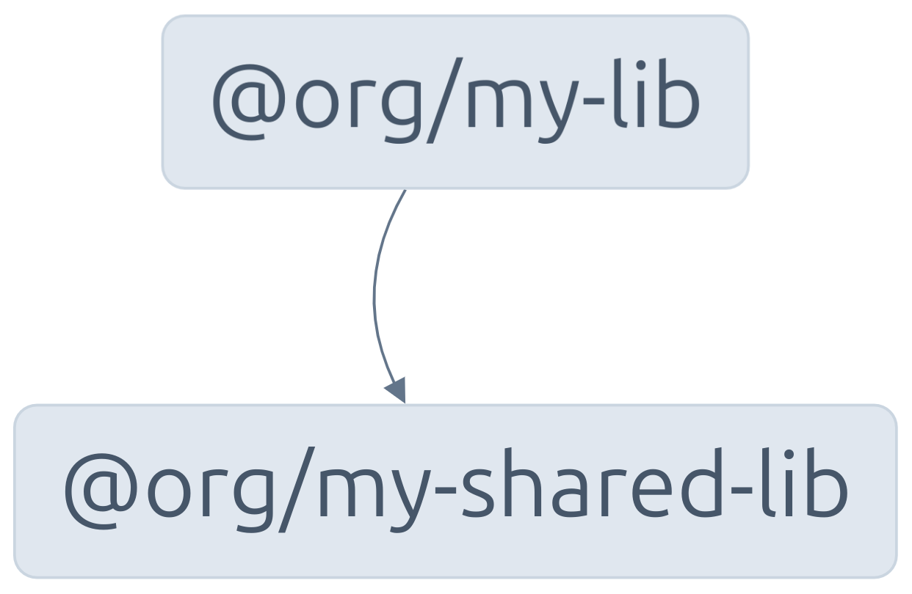

# App preset

> Demo for the article **[Nx 20: Exploring the new TS preset and TypeScript project references](https://edbzn.github.io/nx-20-exploring-the-new-ts-preset-and-typescript-project-references/)**

📂 [Compare files](https://github.com/edbzn/nx-preset-ts/compare/main...preset-apps?expand=1) between the TS preset with the traditional integrated setup (app preset).

